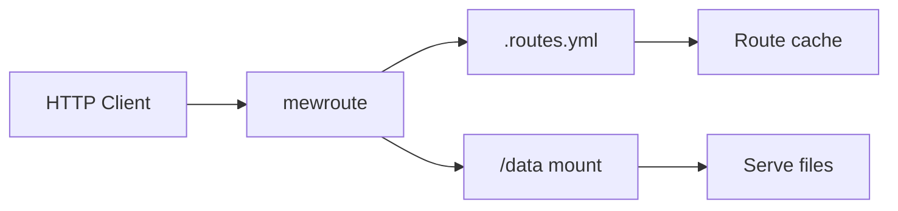

# mewroute

[](https://github.com/mewisme/mewroute/actions/workflows/ci.yml)

**mewroute** is a lightweight, configurable static file router written in Go. It serves files from a mounted directory over HTTP with per-folder routing rules, rewrites, redirects, and SPA-style `dist` fallbacks.

**Security model:** mewroute never executes files. Scripts (`.sh`, `.ps1`, `.bat`, `.js`, etc.) are always returned as static content.



## Features

- Default filesystem routing (`/path/to/file` maps to `data/path/to/file`)
- Per-directory `.routes.yml` configuration (nested scopes)
- Rewrite, redirect, file, and dist (SPA) routes
- Wildcard routes (`/docs/*`)
- Directory listings (opt-in)
- Automatic README.md → HTML rendering for directory URLs
- Custom response headers per scope
- Hot reload of configuration and file metadata caches
- Structured JSON logging
- `GET` / `HEAD`, MIME types, `ETag`, `Last-Modified`, range requests
- Single static binary, Alpine Docker image (~10 MB)

## Quick start

### Docker Compose

```bash
git clone https://github.com/mewisme/mewroute.git
cd mewroute
docker compose up --build
```

Open [http://localhost:8080/app/](http://localhost:8080/app/) for the demo SPA, or [http://localhost:8080/scripts/hello](http://localhost:8080/scripts/hello) for a rewrite example.

Mount your own content by replacing the `./data` volume in `docker-compose.yml`:

```yaml
volumes:
  - ./data:/data:ro
```

### Docker

```bash
docker build -t mewroute .
docker run --rm -p 8080:8080 -v "$(pwd)/data:/data:ro" mewroute
```

Published images (`ghcr.io/mewisme/mewroute`) are **multi-arch manifests** (`linux/amd64`, `linux/arm64`). Tags like `latest`, `1.0.0`, or `v1.0.0` auto-select the correct architecture on pull.

Releases are published by pushing a semver tag (`v1.0.0`) or running the [Docker publish workflow](.github/workflows/docker-publish.yml) manually.

```bash
docker pull ghcr.io/mewisme/mewroute:latest
```

### Binary

Requires **Go 1.26+** to build:

```bash
go build -o mewroute ./cmd/mewroute
ROOT_DIR=./data PORT=8080 ./mewroute
```

## Directory layout

```
data/
  scripts/
    hello.ps1
    .routes.yml
  tools/
    linux/
      setup.sh
  app/
    .routes.yml
    build/
      index.html
      assets/
```

Without configuration, files are exposed at their filesystem path:

| File | URL |
|------|-----|
| `data/scripts/hello.ps1` | `GET /scripts/hello.ps1` |
| `data/tools/linux/setup.sh` | `GET /tools/linux/setup.sh` |

## Routing priority

Requests are resolved in this order:

1. **Exact** configured routes
2. **Wildcard** configured routes (`*` in `from`)
3. **Dist** routes (longest URL prefix match)
4. **Physical file** on disk
5. **Directory index** (`index.html`, `index.htm`)
6. **README** (`readme.md`, any case) — auto-rendered as HTML
7. **Directory listing** (if `listing: true` for the scope)
8. **404**

Each `.routes.yml` applies only to its directory and subdirectories. Child directories may define their own configuration. When multiple scopes match, the **longest URL prefix** wins for headers, listing, and dist.

## `.routes.yml` reference

Place `.routes.yml` in any directory under `ROOT_DIR`, including the content root itself (`data/.routes.yml`). Route `from` paths are relative to that directory's URL prefix.

**Target paths (`to`):**

- `./file` or `file` — relative to the config file's directory
- `/scripts/file` — relative to `ROOT_DIR` (content root)

| Field | Description |
|-------|-------------|
| `routes` | List of route rules |
| `routes[].from` | URL path suffix (e.g. `/hello`, `hello`, `/api/*`) |
| `routes[].to` | Target path (relative to config directory, or `/`-rooted from `ROOT_DIR`) or redirect URL |
| `routes[].type` | `rewrite`, `redirect`, or `file` |
| `routes[].status` | Redirect only: `301`, `302`, `307`, `308` |
| `routes[].download` | File only: set `Content-Disposition: attachment` |
| `dist.path` | Directory to serve (relative path) |
| `dist.fallback` | SPA fallback file when no asset matches |
| `listing` | `true` / `false` (default: `false`) |
| `headers` | Custom headers applied to responses in this scope |

### Rewrite

`data/scripts/.routes.yml`:

```yaml
routes:
  - from: /hello
    to: ./hello.ps1
    type: rewrite
```

| Request | Result |
|---------|--------|
| `GET /scripts/hello` | Serves `hello.ps1` (URL unchanged) |

### Redirect

Same-site path:

```yaml
routes:
  - from: /old
    to: /scripts/hello
    type: redirect
    status: 302
```

External domain:

```yaml
routes:
  - from: /docs
    to: https://example.com/docs
    type: redirect
    status: 301
```

Redirect `to` accepts:

- Same-site paths: `/scripts/hello`, `hello`
- External URLs: `https://example.com/path`, `http://example.com`
- Protocol-relative URLs: `//cdn.example.com/asset.js`

Only `http` and `https` schemes are allowed.

### File download

```yaml
routes:
  - from: /download
    to: ./hello.ps1
    type: file
    download: true
```

### Dist / SPA

`data/app/.routes.yml`:

```yaml
dist:
  path: ./build
  fallback: index.html

headers:
  Cache-Control: no-store
  X-App: demo
```

| Request | Serves |
|---------|--------|
| `GET /app/` | `build/index.html` |
| `GET /app/users/1` | `build/index.html` (fallback) |
| `GET /app/assets/main.js` | `build/assets/main.js` |

### Wildcard

```yaml
routes:
  - from: /docs/*
    to: ./hello.ps1
    type: file
```

### Directory listing

```yaml
listing: true
```

### README rendering

If a directory contains `readme.md` (any casing, e.g. `README.md`, `readme.MD`), visiting that directory URL automatically serves the file rendered as HTML. No `.routes.yml` entry is required.

| File | URL |
|------|-----|
| `data/readme.md` | `GET /` |
| `data/docs/README.md` | `GET /docs/` |

`index.html` takes priority over `readme.md`. Direct file access (e.g. `GET /readme.md`) still returns the raw markdown file.

## Environment variables

| Variable | Default | Description |
|----------|---------|-------------|
| `ROOT_DIR` | `/data` | Content root directory |
| `PORT` | `8080` | HTTP listen port |
| `LOG_LEVEL` | `info` | `debug`, `info`, `warn`, `error` |
| `READ_TIMEOUT` | `30s` | Server read timeout |
| `WRITE_TIMEOUT` | `60s` | Server write timeout |
| `WATCH_POLL_INTERVAL` | `5s` | Rescan `ROOT_DIR` for new folders and refresh caches (`0` disables polling) |

## Security

- **Read-only mount** recommended (`:ro` in Docker)
- **Path traversal** blocked via canonical path checks
- **`.routes.yml`** is never publicly accessible (always `404`)
- Files are **never executed** — only served as content
- Only `GET` and `HEAD` are allowed (`405` otherwise)

## Health check

```
GET /healthz → 200 ok
```

## Architecture

```
cmd/mewroute/          Entry point
internal/
  app/                 Wiring and lifecycle
  config/              Env + YAML parsing
  router/              Route table and resolution
  filesystem/          Safe paths, caching, file serving
  listing/             HTML directory index
  server/              HTTP handler
  watcher/             fsnotify hot reload
  logx/                Structured logging
```

Caches:

- **Route cache** — atomic snapshot of all `.routes.yml` rules
- **Stat cache** — file metadata, invalidated on filesystem changes
- **Config reload** — debounced via `fsnotify` (no restart required)
- **Live content updates** — edit files under `data/` on the host while mewroute is running; changes are picked up automatically (new folders are detected every `WATCH_POLL_INTERVAL`)

## Troubleshooting

### `Permission denied` when creating files in `data/` on the host

The `:ro` flag in `docker-compose.yml` only makes the mount **read-only inside the container**. It does **not** block you from editing `./data` on the server.

If `mkdir` or `cp` fails on the host, the directory is usually owned by `root` because Docker was run with `sudo`:

```bash
ls -la ~/docker/mewroute/data
sudo chown -R "$USER:$USER" ~/docker/mewroute/data
chmod -R u+rwx ~/docker/mewroute/data
mkdir ~/docker/mewroute/data/wrec
```

Avoid `sudo docker compose` for day-to-day use so new files stay owned by your user. mewroute only needs read access inside the container.

## Development

```bash
go test -race -cover ./...
go vet ./...
ROOT_DIR=./testdata go run ./cmd/mewroute
```

See [CONTRIBUTING.md](CONTRIBUTING.md) for contribution guidelines.

## License

[MIT](LICENSE)
